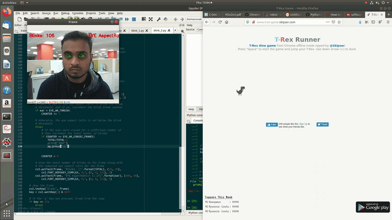

# Eye-Blinking-to-play-T-rex
## What is this repo
- A program which detects eye blink and makes the T-rex jump over cactus.
## Requirements
- webcam
- python 3.7
- pyautogui
- OpenCv
- imutils( to get the facial landmarks)
- and a shape_predictor file which has the pre trained facial landmarks
## How to run
- First download the shape-predictor.dat file from the link("dlib.net/files/shape_predictor_68_face_landmarks.dat.bz2") and save it in the same folder where blink.py exists
- Open terminal from this page and activate your environment which has the above mentioned requirements.
- Next open the T-rex game in another window and keep this window on the right side.(link to open T-rex game-"http://www.trex-game.skipser.com/")
- Run this command on your terminal "python blink.py -p shape_predictor_68_face_landmarks.dat".(Note: mention the path of your shape_predictor_68_face_landmarks.dat if its outside the same folder, else just the name is enough)
## Demo

